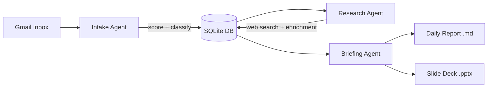

# Email Triage System

AI-powered lead classification pipeline that automatically scores, researches, and prioritizes inbound sales emails — so reps spend time selling, not sorting. Built with Claude, custom agents, and MCP integrations.

## Architecture



Three agents, each with a different SLA:

| Agent | Purpose | Timing | Key Tools |
|-------|---------|--------|-----------|
| **Intake** | Classify intent, score leads 1–100 | Real-time | Gmail MCP, lead_scorer |
| **Research** | Company intel — funding, news, size | Background | Web Search, NotebookLM |
| **Briefing** | Daily priority report + slide deck | Scheduled | report_formatter, python-pptx |

## Quick Start

```bash
git clone <repo-url> && cd email-triage-system
pip install -r requirements.txt
cp .env.example .env   # add your ANTHROPIC_API_KEY

# Run the full pipeline with sample data
python main.py full --demo
```

Results appear in `reports/` — a markdown briefing and a PowerPoint deck.

## Scoring Rubric (100 pts)

| Dimension | Points | Why |
|-----------|--------|-----|
| Intent Score | 0–30 | Strongest predictor of close |
| Domain Quality | 0–25 | Company tier filtering |
| Urgency Signals | 0–20 | Timeline, budget, competitive mentions |
| Content Depth | 0–15 | Detail correlates with seriousness |
| Sender Authority | 0–10 | Decision-makers close faster |

**Grades:** A = 80–100 · B = 60–79 · C = 40–59 · D = 0–39

## Project Structure

```
├── main.py                  # CLI entry point (--demo flag)
├── schema.sql               # Database schema (SQLite + Postgres compatible)
├── src/
│   ├── agents/
│   │   ├── intake_agent.py  # Classification + scoring
│   │   ├── research_agent.py # Company research
│   │   └── briefing_agent.py # Daily report + slides
│   ├── pipeline/run.py      # Orchestration
│   ├── plugins/
│   │   ├── lead_scorer.py   # Custom scoring rubric
│   │   └── report_formatter.py # Markdown + PPTX output
│   └── db.py                # Database helpers
├── tests/fixtures/          # Sample emails for demo mode
├── reports/                 # Generated output (gitignored)
└── data/                    # SQLite DB (gitignored)
```

## Storage

This prototype uses **SQLite** — zero setup, clone-and-run. The schema is written to drop into Postgres unchanged for production use.

**Production path:** Supabase/Postgres for structured data, a vector store (Pinecone, ChromaDB) for semantic email search, and a job queue (Celery/Bull) for the research agent.

## Scaling to Production

This is a single-user prototype demonstrating the architecture. A production deployment would add:

- Gmail API with per-user OAuth (not a single service account)
- Hosted database (Supabase or AWS RDS)
- Job queue for async research (Celery, Bull, or SQS)
- Role-based dashboard access
- Deployment to Railway or Fly.io

## Built With

Claude Code · Cowork · Gmail MCP · SQLite MCP · python-pptx
